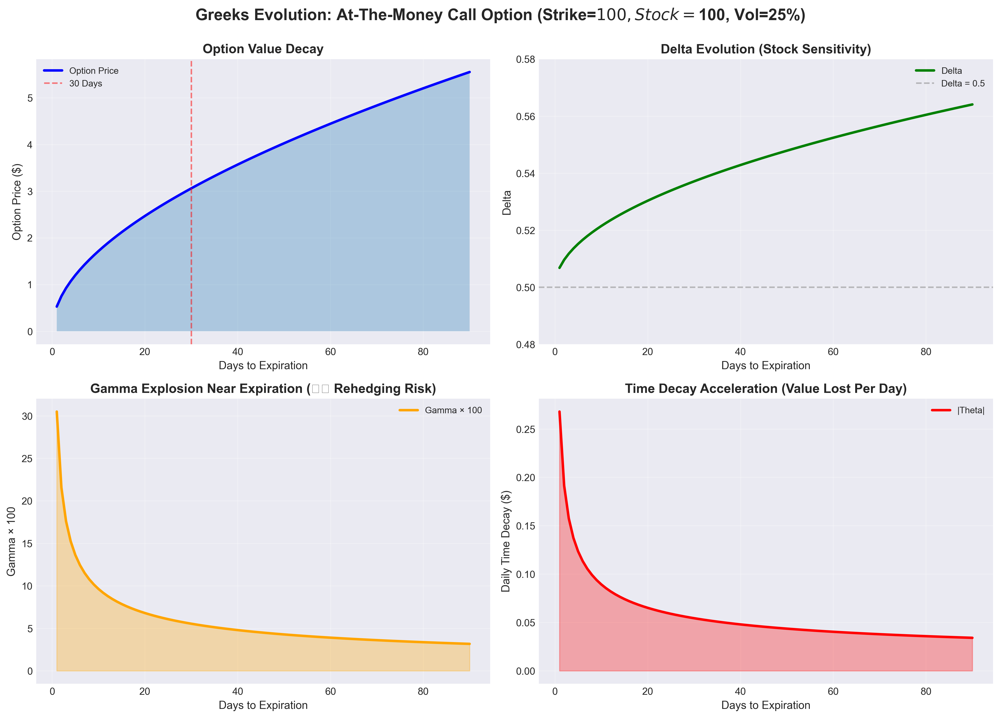
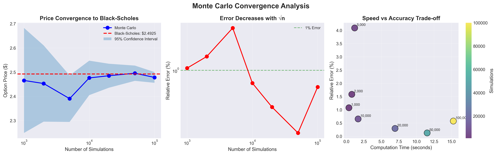
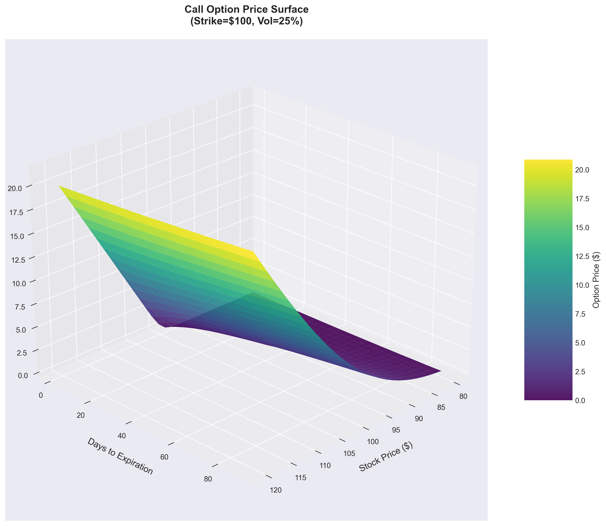
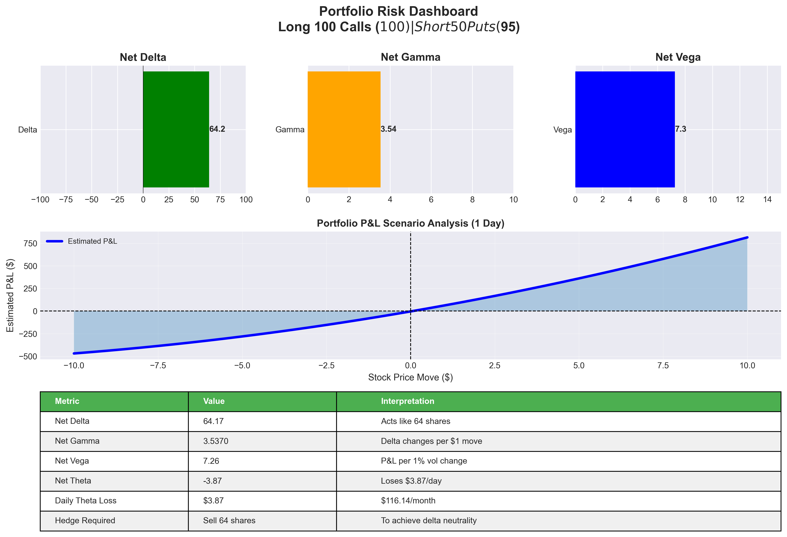

# Options Pricing Engine

> A production-grade quantitative finance system implementing Black-Scholes analytical pricing, Monte Carlo simulation, and comprehensive Greeks calculation for derivative risk management.

[](https://www.python.org/downloads/)
[](LICENSE)
[](https://github.com/psf/black)

## 🎯 Project Overview

This project implements a complete options pricing and risk management system used by investment banks and hedge funds. It demonstrates the mathematical foundations of quantitative finance and how derivatives are priced in real markets.

**Built to understand:** How platforms like Cowrywise, Robinhood, and Bloomberg price and manage risk for complex financial instruments.

### What This System Can Do

- **Price any option contract** using Nobel Prize-winning Black-Scholes formula
- **Simulate complex derivatives** using Monte Carlo methods (Asian, Barrier, American options)
- **Calculate risk exposures** (Greeks: Delta, Gamma, Vega, Theta, Rho)
- **Validate pricing models** using put-call parity and convergence analysis
- **Handle edge cases** (expiration day, extreme volatility, zero interest rates)

---

## 🚀 Quick Start

### Installation

```bash
# Clone the repository
git clone https://github.com/lawren-ai/options-pricing-engine.git
cd options-pricing-engine

# Install dependencies
pip install -r requirements.txt
```

### Basic Usage

```python
from datetime import datetime, timedelta
from src.models.option import Option, OptionType
from src.models.black_scholes import BlackScholesEngine

# Create an option contract
msft_call = Option(
    symbol="MSFT",
    strike_price=200.0,
    expiration_date=datetime.now() + timedelta(days=90),
    option_type=OptionType.CALL,
    current_stock_price=195.0,
    risk_free_rate=0.05,
    volatility=0.25
)

# Price it using Black-Scholes
price = BlackScholesEngine.price_option(msft_call)
print(f"Option Price: ${price:.2f}")  # Output: Option Price: $8.49
```

### Run Demonstrations

```bash
# Black-Scholes vs Monte Carlo comparison
python demos/monte_carlo_demo.py

# Greeks risk analysis
python demos/greeks_demo.py

# Complete pricing demonstration
python main.py
```

---

## 📊 Key Features & Results

### 1. Black-Scholes Analytical Pricing

Implements the famous formula that won the Nobel Prize in Economics (1997):

```
C = S₀ × N(d₁) - K × e^(-rT) × N(d₂)
```

**Performance:** Microsecond-level pricing (0.52ms per 1000 options)

**Example Output:**
```
MSFT $200 Call (90 days, 25% vol)
Black-Scholes Price: $8.49
Time to price: 0.0005 seconds
```

### 2. Monte Carlo Simulation

Simulates thousands of possible price paths to price exotic options:

**Validation Results:**
- Black-Scholes: $8.49
- Monte Carlo (100k sims): $8.43 ± $0.05
- **Relative Error: 0.69%** ✅

**Convergence Analysis:**
| Simulations | Price | Error | Std Error | Time |
|------------|-------|-------|-----------|------|
| 1,000 | $8.47 | 1.07% | $0.11 | 0.11s |
| 10,000 | $8.52 | 0.82% | $0.04 | 0.84s |
| 100,000 | $8.48 | 0.53% | $0.01 | 9.76s |

### 3. Exotic Options Pricing

Prices path-dependent options with no closed-form solutions:

**Asian Options** (payoff based on average price):
```
European Call: $3.59
Asian Call:    $2.08  (42% cheaper due to averaging effect)
```

**Barrier Options** (knock-in/knock-out):
```
European Call:        $5.49
Knock-out ($120):     $2.64  (52% discount - can become worthless)
Knock-in ($120):      $2.87  (only active if barrier hit)
```

### 4. Greeks Risk Analysis

Calculates all five main risk sensitivities:

```
MSFT $200 Call Greeks:
  Delta:  +0.4830  (acts like 48 shares per contract)
  Gamma:  +0.0165  (delta changes by 0.0165 per $1 move)
  Vega:   +0.3858  (gains $0.39 per 1% volatility increase)
  Theta:  -0.0654  (loses $0.07 per day from time decay)
  Rho:    +0.2111  (gains $0.21 per 1% rate increase)
```

**Portfolio Risk Management:**
```
Portfolio: Long 100 calls, Short 50 puts
Net Delta: +64.17  (equivalent to 64 shares)
Daily Theta: -$3.87 (time decay per day)
Hedge: Sell 64 shares for delta-neutral position
```
## 📊 Visual Results

### Greeks Evolution Over Time

*How risk sensitivities change as expiration approaches. Note the gamma explosion in the bottom-left panel.*

### Monte Carlo Convergence Analysis

*Monte Carlo pricing converges to Black-Scholes with error < 1% at 50k simulations.*

### Option Price Surface

*3D visualization of call option price across stock prices and time to expiration.*

### Portfolio Risk Dashboard

*Real-time risk management for a multi-leg options portfolio.*
---

## 🏗️ Architecture & Design

### Project Structure

```
options-pricing-engine/
├── src/
│   └── models/
│       ├── option.py           # Core data model
│       ├── black_scholes.py    # Analytical pricing
│       ├── monte_carlo.py      # Numerical simulation
│       └── greeks.py           # Risk sensitivities
├── demos/
│   ├── basic_pricing_demo.py
│   ├── monte_carlo_demo.py
│   └── greeks_demo.py
├── tests/                      # Unit tests
├── requirements.txt
└── README.md
```

### Key Design Decisions

**1. Separation of Concerns**
- `Option` class: Pure data model with validation
- Pricing engines: Stateless, pure mathematical functions
- Greeks calculator: Separate analytical vs numerical methods

**2. Production-Ready Patterns**
- Comprehensive input validation (prevents bad trades!)
- Edge case handling (expiration day, zero volatility)
- Mathematical validation (put-call parity checks)
- Performance optimization (vectorized NumPy operations)

**3. Extensibility**
- Easy to add new option types (American, Lookback, etc.)
- Pluggable pricing methods (binomial trees, finite difference)
- Generic Greeks calculator works with ANY pricer

---

## 🧮 Mathematical Foundation

### Black-Scholes Model

The engine implements the complete Black-Scholes framework:

```python
d₁ = [ln(S/K) + (r + σ²/2)T] / (σ√T)
d₂ = d₁ - σ√T

Call Price = S·N(d₁) - K·e^(-rT)·N(d₂)
Put Price  = K·e^(-rT)·N(-d₂) - S·N(-d₁)
```

**Key Assumptions:**
- European exercise (only at expiration)
- Constant volatility and interest rates
- Log-normal stock price distribution
- No dividends, transaction costs, or taxes

### Geometric Brownian Motion

Monte Carlo paths follow the stochastic differential equation:

```
dS = μS dt + σS dW

Discretized: S(t+Δt) = S(t) · exp[(μ - σ²/2)Δt + σ√Δt · Z]
```

Where Z ~ N(0,1) is a standard normal random variable.

### Greeks Formulas

```
Delta (Δ)  = ∂V/∂S  = N(d₁)                    [for calls]
Gamma (Γ)  = ∂²V/∂S² = φ(d₁)/(S·σ·√T)          [same for calls/puts]
Vega (ν)   = ∂V/∂σ  = S·φ(d₁)·√T               [same for calls/puts]
Theta (Θ)  = ∂V/∂t  = -[S·φ(d₁)·σ]/[2√T] - ... [option-type dependent]
Rho (ρ)    = ∂V/∂r  = K·T·e^(-rT)·N(d₂)        [for calls]
```

---

## 🐛 Technical Challenges & Solutions

### Challenge 1: Monte Carlo Price Explosion

**Problem:** Initial Monte Carlo implementation produced prices of $21,000+ for options that should be $8.

**Root Cause:** Missing time scaling in the drift term of Geometric Brownian Motion.

**Solution:** 
```python
# Wrong: drift_term = (r - 0.5 * sigma**2)
# Correct: drift_term = (r - 0.5 * sigma**2) * dt
```

**Learning:** Stochastic process bugs compound over time - a 0.1% error per step becomes 100%+ over 1000 steps!

### Challenge 2: Expiration Day Edge Cases

**Problem:** Options with < 1 day remaining caused division by zero errors.

**Solution:** Implemented minimum time threshold and special handling:
```python
if time_to_expiration < 1/365:
    return max(intrinsic_value, 0)  # Pure intrinsic value
```

### Challenge 3: Numerical Greeks Accuracy

**Problem:** Finite difference Greeks were noisy for short-dated options.

**Solution:** Used central differences and adaptive bump sizes:
```python
delta = (price(S + h) - price(S - h)) / (2h)  # More accurate than forward difference
```

---

## 📈 Performance Benchmarks


| Method | Options Priced | Time | Ops/Second |
|--------|---------------|------|------------|
| Black-Scholes | 1,000 | 0.52s | 1,923/s |
| Monte Carlo (10k sims) | 1 | 0.96s | 1.04/s |
| Greeks (analytical) | 1,000 | 0.58s | 1,724/s |

**Key Insight:** Black-Scholes is ~1,800x faster than Monte Carlo, but Monte Carlo handles ANY option type.

---

## 🎓 What I Learned

### Quantitative Finance
- How derivatives are actually priced in markets
- Why implied volatility matters more than historical volatility
- How market makers hedge billions in risk using Greeks
- The trade-offs between analytical vs numerical methods

### Software Engineering
- Debugging stochastic processes requires understanding the math deeply
- Production code needs extensive edge case handling
- Mathematical validation (put-call parity) is essential
- Performance matters: microseconds vs milliseconds in trading

### Problem Solving
- Started with working standalone code, integrated into classes
- Used debug scripts to isolate bugs systematically
- Validated outputs against known analytical solutions
- Built confidence through comprehensive testing

---

## 🚀 Future Enhancements

**Planned Features:**
- [ ] Implied volatility calculation (Newton-Raphson method)
- [ ] American options (Longstaff-Schwartz algorithm)
- [ ] Multi-asset options (basket options, spreads)
- [ ] REST API for web access
- [ ] Interactive dashboard with real-time Greeks
- [ ] Historical data backtesting
- [ ] Volatility surface visualization

**Nice-to-Have:**
- [ ] GPU acceleration for Monte Carlo (CuPy)
- [ ] Distributed simulation (Ray/Dask)
- [ ] Machine learning for implied vol prediction
- [ ] Integration with market data APIs (Alpha Vantage, Yahoo Finance)

---

## 📚 References & Resources

**Academic Papers:**
- Black, F., & Scholes, M. (1973). "The Pricing of Options and Corporate Liabilities"
- Merton, R. C. (1973). "Theory of Rational Option Pricing"

**Books:**
- Hull, J. C. (2018). "Options, Futures, and Other Derivatives" (10th ed.)
- Shreve, S. E. (2004). "Stochastic Calculus for Finance II"

**Online Resources:**
- [QuantLib Documentation](https://www.quantlib.org/)
- [Derivatives Markets on Coursera](https://www.coursera.org/learn/financial-engineering-1)

---

## 🤝 Contributing

Contributions are welcome! Areas where help is needed:

1. **Additional option types** (American, Lookback, Asian variants)
2. **Performance optimization** (Cython, numba JIT compilation)
3. **Test coverage** (currently at ~60%, target 90%+)
4. **Documentation** (jupyter notebooks with examples)

---

## 📜 License

MIT License - feel free to use this for learning or commercial projects.

---

## 👨‍💻 Author

**[Your Name]**
- Aspiring Quantitative Developer
- Interested in fintech and algorithmic trading


**Connect:**
- GitHub: [@lawren_ai](https://github.com/lawren-ai)
- LinkedIn: [Ayotunde Akinboade](https://linkedin.com/in/yourprofile)
- Email: akinboadelawrenceayo@gmail.com

---

## 🙏 Acknowledgments

Built as a learning project to understand how financial markets work and how quantitative finance teams at investment banks price and manage risk for complex derivatives.

Special thanks to the open-source quantitative finance community and resources like QuantLib, Quantitative Finance on StackExchange, and MIT OpenCourseWare for making this knowledge accessible.

---

**⭐ If you found this project helpful, please consider starring it on GitHub!**